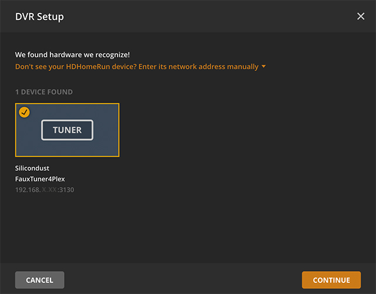
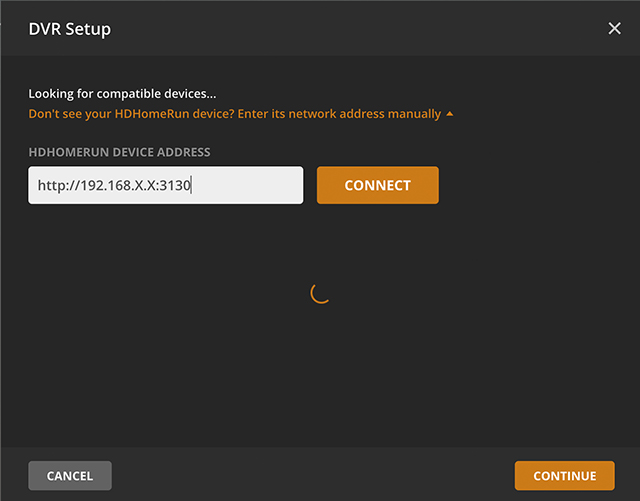
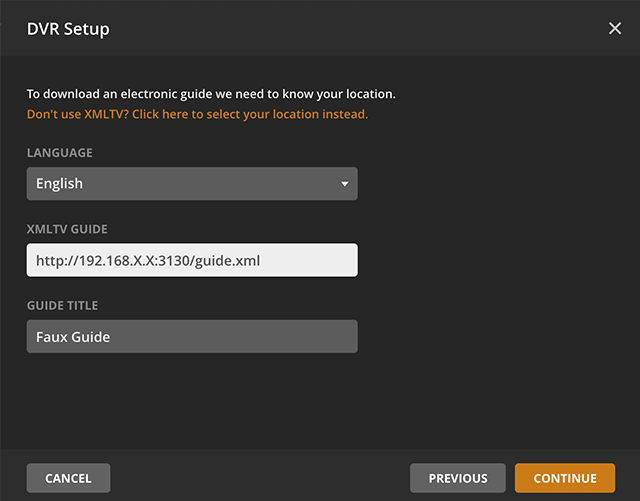

## `faux-tuner`

A virtual tuner card and EPG guide for online live TV sources like PlutoTV and Locast. Designed to work with Plex Media Server's [Live TV / DVR](https://www.plex.tv/tv/) feature.

Largely inspired by (and parts shamelessy stolen from) [locast2plex](https://github.com/tgorgdotcom/locast2plex).


##### Services
- PlutoTV
- Locast
- IPTV / HLS Streams (coming soon)
- Redbox Live TV (coming soon)
  https://www.redbox.com/stream-free-live-tv

### Requirements
- `ffmpeg` faux-tuner uses `ffmpeg` under the hood to repackage the live feed to mpegts.

  **Mac**<br />
  ```bash
  brew install ffmpeg
  ```

  **Linux**<br />
  ```bash
  sudo apt-get install ffmpeg
  ```

  **Windows**<br />
  https://github.com/adaptlearning/adapt_authoring/wiki/Installing-FFmpeg


### Installation
```
npm install -g faux-tuner
```
> You may need to use `sudo`:<br>`sudo npm install -g faux-tuner`

### Starting
```bash
faux-tuner start
```

### Simple Server Example
```javascript
const fauxTuner = require('faux-tuner');

fauxTuner.listen(3130, () => {
  console.log('Server listening at localhost:3130');
});
```


### Express Middleware Example
```javascript
const express = require('express');
const fauxTuner = require('faux-tuner');
const app = express();

app.use(fauxTuner);

app.listen(3130, () => {
  console.log('Server listening at localhost:3130');
});

```

## Setting up Services

First configure and enable your Live TV providers using the FauxTuner web interface. You can access these at `http://localhost:3130/web/` once your installation of Faux Tuner is up and running.

> **Default Web UI Login:**<br>
> Username: `admin`<br>
> Password: `fauxtuner`<br>


#### Locast
1. Login to the faux-tuner web UI.
1. Click on the Lodash secion.
1. Enter your login credentials.

> An active Locast account is required to access this service. Learn more at https://locast.org


#### PlutoTV


### Setting up Plex Media Server

To use the Live TV and DVR features with Plex Media Server, you'll need a [Plex Pass](https://www.plex.tv/plex-pass/). For the most part the setup process is similar to any other tuner card on Plex.

1. In your settings, navigate to the Live TV & DVR section and select "Set Up DVR".

1. The faux tuner card should automatically appear as `FauxTuner4Plex`.

 

 >Note the IP address that's displayed below the tuner card. You'll need it to setup the guide.

 >If the tuner doesn't appear automatically after a few seconds, you can try and connect manually. Enter the local IP address of the device running Faux Tuner, with the port `3130`
 

1. Once Plex connects to the tuner card, you should see a list of channels. If not, try scanning the channels a few times.

1. Select the "Use XMLTV guide on your server" option to manually enter the guide URL. Since we're using online TV sources, we don't want to use the OTA data Plex provides via zip code.

 

 >**Guide URL:** `http://192.168.X.X:3130/guide.xml`

1. Grab the popcorn, that's it! After the guide updates, navigate to the new Live TV and DVR library and binge away!
